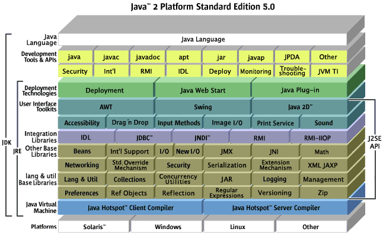

# JDK 5

> <b>개요</b>
- _`JDK 5`_ 버전은 2004년 9월에 출시된 Java Development Kit입니다.
- JDK 5를 정확히 표현하자면 Java 2 Platform Standard Edition(J2SE) 5.0 Development Kit이라고 하며
- Product version을 기준으로 JDK 5.0, Developer version 기준으로 1.5.0이라고 불립니다.
- _`JDK 5`_ 버전이 출시되며 `Generics`, `향상된 for Loop`, `Autoboxing/Unboxing`, `Enum`, `Varargs`, `Static Import`, `Metadata` 등의 기능이 추가되었는데
- 각 기능이 어떤 역할을 하는지 알아보겠습니다.

### JDK 5 Structure


### Generics
- Collection에서 Element를 가져올 때 저장된 데이터의 타입에 맞게 가져와야 합니다.
- 기존에는 Element를 가져올 때 아래 `예시 1`과 같이 `개발자가 직접 Type Casting`을 해줬습니다.

    ```java
        /* 예시 1 */
        1 static void printElement(Collection c) {
        2    for(Iterator i = c.iterator(); i.hasNext();) {
        3        // 직접 TypeCasting
        4        String value = (String) i.next();
        5        System.out.println(value);
        6    }
        7 }
    ```
- 개발자들이 Collection에 어떤 데이터가 전달되는지 이미 알고있다면 `예시 1`과 같이 사용해도 됩니다.
- 하지만 신규 개발자가 Collection에 저장된 데이터의 타입을 모른다면?
- **아마 잘못된 TypeCasting을 하겠죠.**
- 신규 개발자가 `예시 1`의 4번줄 소스코드를 아래와 같이 변경했다고 가정하겠습니다.
    ```java
        int value = (int) i.next();
    ```
- Java에서는 value의 타입(int)과 Element(i.next())의 타입(int)만 확인하면 되기 때문에 개발 과정에서 에러가 발생하지 않습니다.
- 하지만 Collection 안에 저장된 Elemet의 데이터 타입은 `String`이기 때문에 Method가 실행되면 오류가 발생할 것입니다. (Run-time Error)
- 아마도 `Numberformatexception`이 발생하겠죠.
- 그럼 Collection 안에 저장된 Element의 데이터 타입을 `미리 알려준다면` 개발하는 과정에서 에러를 발견할 수 있지 않을까요? (Compile-time error)
- 이러한 역할을 하는 기능이 바로 `Generics`입니다.
- Generics는 Collection의 데이터 타입을 컴파일러에게 전달하고,
- 컴파일러는 Collection의 Generics가 알려준 데이터 타입으로 TypeCasting하여 Element를 가져옵니다.
- 그럼 더이상 개발자가 TypeCasting을 고민할 필요가 없겠죠?
- 즉, 데이터 타입에 대해 명확하고 안전한 소스코드를 작성할 수 있게 됩니다.
- Generics가 적용된 소스 코드는 아래 `예시 2`와 같이 작성할 수 있습니다.
    ```java
        /* 예시 2 */
        1 // <String>를 통해 문자열 c의 컬렉션임을 알 수 있다.
        2 static void printElement(Collection<String> c) {
        3    for(Iterator i = c.iterator(); i.hasNext();) {
        4        // Compiler가 TypeCasting하여 값을 가져온다.
        5        String value = i.next();
        6        System.out.println(value;)
        7    }
        8 }
    ```
- `예시 2`에서 작성한 것과 같이 `<>` 안에 데이터 타입을 작성해주면 Compiler가 알아서 TypeCasting을 합니다.
    - 참고로 `A<Type> b` 코드는 `A of Type b`라고 읽는다고 합니다.
    - `예시 2`의 1번줄에 작성한 것과 같이 `문자열 c의 Collection`이라고 읽는다고 하네요.
- Generics는 매개변수에만 사용할 수 있는 것은 아닙니다.
- 아래 `예시 3`과 같이 Method의 반환 타입으로도 사용할 수 있습니다.
- 또한 `예시 4`와 같이 반환할 데이터 타입을 매개변수로 전달받아 사용할 수도 있습니다.
    ```java
        /* 예제 3 */
        1 static List<String> getUserNames(...) {
        2    // 문자열 userNames의 List 생성
        3    // userNames는 문자열로 된 사용자 이름의 목록을 저장하는 List Collection입니다.
        4    List<String> userNames = new ArrayList<String>();
        5    
        6    // 사용자 이름 목록을 조회하는 기능 구현...
        7
        8    // List<String> 타입의 데이터를 반환합니다.
        9    return userNames;
        10 }

        /* 예제 4 */
        // Documentation에는 아래 주석과 같이 작성 예시 소스코드를 보여주고 있습니다.
        // <T extends Annotation> T getAnnotation(Class<T> annotationType); 
        static <T> List<T> getCustomTypeList(Class<T> c) {
            List<T> list = new ArrayList<T>();

            // 기능 구현...

            return list;
        }
    ```
- 그럼 Generics의 단점은 무엇일까요?
- 잘못 동작하는 레거시 코드와 같이 동작할 때 TypeCast가 실패할 수도 있다는 것입니다.
- 예를 들어 정수를 삽입하는 문자열 s가 있다고 가정하겠습니다.
- 정수의 값은 Generics에 의해 문자열로 TypeCasting을 시도하는데 데이터 타입이 맞지 않기 때문에 실패할 수 있습니다.
- 이때 java.util.Collections에서 제공하는 Wrapper Class를 활용하면 Run-time 시 안전성을 보장할 수 있습니다.
    ```java
        1 // 레거시 코드로 인해 TypeCasting에 실패할 수 있음
        2 Set<String> s = new HashSet<String>();
        3
        4 // 레거시 코드가 정수를 삽입하려고 시도하는 시점에서 ClassCastException을 발생시킵니다.
        5 // 이 때 결과 스택 추적을 통해 문제를 진단하고 복구할 수 있습니다.
        6 // 즉, Collections가 한 번 더 체크하기 때문에 에러에 대한 안전성을 확보할 수 있음
        7 Set<String> s = Collections.checkedSet(new HashSet<String>(), String.class);
    ```

### 향상된 for문
- 먼저 JDK 1.5 버전이 출시되기 이전의 for문을 보겠습니다.
    ```java
        // 1. Documentation에 나온 for문
        1 void cancelAll(Collection<TimerTask> c) {
        2    for(Iterator<TimerTask> i = c.iterator(); i.hasNext();) {
        3        i.next().cancel();
        4    }
        5 }

        // 2. 많이 작성하는 for문
        6 for(int i=0; i < c.size(); i++) {
        7    TimerTask timerTask = c.get(i);
        8    timerTask.cancel();
        9 }
    ```
- 제가 Document를 잘 이해한 것인지는 모르겠지만...
- 1번 반복문에서 변수 i가 3번 사용되었죠?
- 초기화를 위해 처음 선언된 i를 빼고 2번 더 선언되는 동안 `개발자의 변수명 작성 실수로 오류가 발생`할 수 있습니다.
- 2번 반목문도 마찬가지죠.
- 이미 변수 i가 4번 사용되었는데 초기화를 위한 변수 i를 제외하고 3번 더 작성하는 동안 동일한 문제로 오류가 발생할 수 있습니다.

- 그럼 소스코드를 작성할 때 `변수 사용을 최소화하면 오류 발생 가능성도 줄어들지 않을까요?`
- `향상된 for문가 이런 문제를 해결`해줍니다.
- 그럼 향상된 for문은 어떻게 작성되는지 볼까요?
    ```java
        // 1. Documentation에 나온 for문
        // 물론 실무에서도 아래와 같이 작성해요.
        1 void cancelAll(Collection<TimerTask> c) {
        2    for(TimerTask timerTask : c) {
        3        timerTask.cancel();
        4    }
        5 }
    ```
- 어떤가요? 소스코드가 정말 간결하지 않나요?
- 향상된 for문에서 `콜론(:)은 in이라고 읽는다`고 해요.
    - 즉, 위에 코드를 설명할 때에는 `"for each TimerTask in c"`라고 읽으면 됩니다.
- 향상된 for문을 이용하면 변수 선언 횟수가 확실히 줄어듭니다.
- 그만큼 효율적으로 개발할 수 있다는 것이겠죠.
- 다만 소스코드가 실행할 때에는 컴파일러가 이전의 for문으로 변환합니다.
- 결국 for문의 작성 방식이 개발자 친화적일 뿐 실제로 동작하는 방식은 동일합니다.
- 그래도 Collections뿐만 아니라 배열도 향상된 for문을 활용하여 데이터를 조작할 수 있으니
- 안정적인 소스코드 구현을 위해 향상된 for문을 사용해봅시다.
    ```java
        // 배열의 향상된 for문 활용
        1 int sum(int[] numberArray) {
        2    int result = 0;
        3    for (int number : numberArray)
        4        result += number;
        5    return result;
        6 }
    ```

### Autoboxing and unboxing
- Java 프로그래머라면 `Collection에 Primitive Type의 데이터를 넣을 수 없다`는 것을 알고 있을거에요.
- 쉽게 말해서 List 객체에 int, long, double, char, boolean 타입의 데이터를 넣을 수 없다는 것을 의미해요.
    ```java
        // Error 발생 : Type argument cannot be of primitive type
        // int 타입을 List 객체에 저장할 수 없어요.
        List<int> numbers = new ArrayList<int>();
    ```
- 그럼 `Collection에 넣을 수 있는 데이터는` 어떤 데이터일까요?
- 당연히 `Reference Type의 데이터`를 넣을 수 있겠죠.
- 그러나 개발을 하다보면 숫자로 구성된 List를 만들어야 할 때가 생겨요.
- 이럴 때에는 어떻게 해야 할까요? List에는 Reference Type의 데이터만 저장할 수 있으니 과감하게 포기해야 할까요?
- Java는 이런 문제를 해결해주기 위해 `Wrapper Class`를 제공하고 있답니다.
- int Type의 데이터는 Integer로, double Type의 데이터는 Double로, boolean Type의 데이터는 Boolean으로!
- 데이터를 Wrapper Class로 한 번 더 감싸주기 때문에 `Boxing`한다고 말해요.
- 그럼 반대로 Integer Type의 데이터를 int Type으로 변환해주는 것을 `Unboxing`이라고 하겠죠?

- JDK 1.5 버전이 출시되기 전에는 int Type의 데이터를 Integer Type의 데이터로 변환하려면 다음과 같이 작성을 했어요.
    ```java
        int one = 1;
        // int Type의 데이터를 Integer Type으로 변환하기
        Integer number = Integer.valueOf(one);
    ```
- 그리고 Integer Type의 데이터를 int Type으로 꺼내려면 다음과 같이 작성했어요.
    ```java
        // number의 값을 int Type으로 가져오기
        int numberValue = number.intValue();
    ```
- 당연히 List에 int Type의 데이터를 저장하고 꺼내기 위해 아래와 같이 작성해야겠죠?
    ```java
        1 List<Integer> numbers = new ArrayList<Integer>();
        2 int one = 1, two = 2;
        3 // int Type의 데이터를 Integer Type으로 변환
        4 Integer number1 = Integer.valueOf(one);    // boxing
        5 Integer number2 = Integer.valueOf(two);    // boxing
        6 // Integer Type의 데이터를 List에 저장
        7 numbers.add(number1);
        8 numbers.add(number2);
        9 System.out.println("numbers : " + numbers.toString());
            // 출력 결과
            // numbers : [1, 2]
        10
        11 for(Integer num : numbers) {
        12      int value = num.intValue(); // unboxing
        13      System.out.println("value : " + value);
        14 }
            // 출력 결과
            // value : 1
            // value : 2
    ```
- 매번 데이터를 Boxing하고 Unboxing 해야하는 불편함이 있죠.
- JDK 1.5 버전에서는 이런 불편함을 모두 해소했습니다!
- 바로 Autoboxing, Autounboxing 기능을 제공하기 때문이죠.
- 그럼 어떻게 변경되었는지 볼까요?
    ```java
         1 List<Integer> numbers = new ArrayList<Integer>();
         2 int one = 1, two = 2;
         3 
         4 // int Type의 데이터를 Integer Type으로 자동 형변환
         5 Integer number1 = one;    // Auto-boxing
         6 Integer number2 = two;    // Auto-boxing
         7 
         8 // Integer Type의 데이터를 List에 저장
         9 numbers.add(number1);
        10 numbers.add(number2);
        11 System.out.println("numbers : " + numbers.toString());
        12 // 출력 결과
        13 // numbers : [1, 2]
        14
        15 for(Integer num : numbers) {
        16      // Integer Type의 데이터를 int Type으로 자동 형변환
        17      int value = num; // Auto-unboxing
        18      System.out.println("value : " + value);
        19 }
        20 // 출력 결과
        21 // value : 1
        22 // value : 2
    ```
- 어떤가요? JDK 1.5 버전이 출시되기 전의 소스코드와 결과가 똑같죠?
- 하지만 valueOf(), intValue()와 같이 Integer Type으로 Boxing하거나 int Type으로 Unboxing하기 위한 메소드를 사용하지 않아도 되요!
- 소스코드가 더 간결해지고 사용하기 쉬워졌죠?
- 다만 `성능이 중요한 기능에 적용할 때에는 성능 저하 우려가 있다`고 하니까 주의해서 사용합시다!

### 참고
- JDK 5.0 Documentation : https://docs.oracle.com/javase/1.5.0/docs/
- Generics : https://docs.oracle.com/javase/1.5.0/docs/guide/language/generics.html
- 향상된 for문 : https://docs.oracle.com/javase/1.5.0/docs/guide/language/foreach.html
